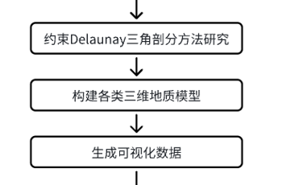

创新点 提到PPT开头去表述✔

**补充论文中内容到PPT**

算法  

如果详细讲，需要逻辑清晰

主要表述时间 给到创新点，详细阐述（对于地质工程应用的重要性

熟悉的地方可以展开表述

# 修改

补充数据表格 ✔

公式

### 第二章内容

第二部分先总体介绍一下内容

（阐述数据生成各个网格模型 得到可视化数据 才能进行三维可视化

补充其余模型内容

### 第三章 

创新点算法内容 

纹理对比结果✔

### 第四章

系统架构 、需求分析等等 补充，可一笔带过✔

一张图一个PPT 附上小标题 以及相应可视化数据✔

可视化组件集成方案

- 组件的迁入

- 数据API的完善：从静态JSON文件访问过渡到通过后端API获取动态数据

- 利用Pinia实现与系统中二维视的高效数据联动和状态同步。

##  现有可视化组件

三维地质体可视化功能由一个独立的 `.vue` 单文件组件实现。

该组件内部封装了所有必要的逻辑和依赖，通过访问本地静态JSON文件来获取和展示可视化数据

组件预留了数据服务（services）的接口，为后续对接后端动态数据API

##  Pinia数据流与页面联动

与系统中二维视图之间的数据共享和状态同步，实现页面联动。

### Pinia Store 设计

我们将创建一个专门的 Pinia Store（例如命名为 `geologyStore`）来管理与地质体可视化相关的共享状态。这个 Store 将包含以下核心部分：

*   **State**: 用于存储需要在不同组件和页面间共享的数据。
    *   `currentGeologicalEntityId`: `string | null` - 当前在二维视图中选中或关注的地质实体ID。当二维视图中点击某个地质体相关的按钮或元素时，此状态会被更新。
    *   `visualizationParams`: `object | null` - 用于控制三维可视化行为的参数对象。例如，可能包含相机视角、高亮显示特定类型的地质体、显示/隐藏某些图层等。当二维视图需要传递参数给三维组件时，可以更新此状态。
    *   `sharedDataCache`: `object` - 用于缓存从后端获取的、可能被多个组件使用的数据，以减少重复请求。例如，地质体列表、元数据等。
    *   `isLoading`: `boolean` - 表示三维组件是否正在加载数据或进行耗时操作，可用于在其他页面显示加载状态。

*   **Getters**: 用于从 State 中派生出一些状态，或者对 State 中的数据进行计算和转换，方便组件直接使用。
    *   `hasActiveEntity`: `boolean` - 根据 `currentGeologicalEntityId` 判断当前是否有活动的地质实体。
    *   `getVisualizationParam(paramName: string)`: `any` - 获取特定的可视化参数。

*   **Actions**: 用于处理异步操作（如API请求）或封装多个 State 的修改逻辑。
    *   `selectGeologicalEntity(entityId: string)`: 当二维视图中的元素被点击时调用，用于更新 `currentGeologicalEntityId`。
    *   `updateVisualizationParams(params: object)`: 用于从其他页面（如二维视图的控制面板）更新三维可视化的参数。
    *   `fetchAndCacheGeologyData(forceRefresh: boolean = false)`: 异步从后端API获取地质数据，并更新 `sharedDataCache` 和 `isLoading` 状态。可以根据 `forceRefresh` 决定是否强制刷新缓存。
    *   `clearActiveEntity()`: 清除当前选中的地质实体。

###  二维视图与 Pinia 的交互

二维视图（或其他需要与三维组件联动的页面）将通过以下方式与 `geologyStore` 交互：

1.  **触发状态变更**：
    *   当用户在二维视图中点击与特定地质体相关的按钮或元素时，二维视图组件会调用 `geologyStore` 中的 `selectGeologicalEntity` action，并传入相应的实体ID。
    *   如果二维视图中有控制面板用于调整三维可视化参数（例如切换显示模式、调整透明度等），这些操作将调用 `updateVisualizationParams` action。

2.  **读取共享状态**（如果需要）：
    *   二维视图也可以根据需要订阅 `geologyStore` 中的状态（例如 `isLoading`）来展示加载指示，或根据 `currentGeologicalEntityId` 来高亮显示当前在三维视图中关注的实体（如果二维视图也展示了这些实体）。

### 3 三维可视化组件与 Pinia 的交互

您的独立三维可视化Vue组件将深度集成 Pinia，以响应共享状态的变化并执行相应操作：

1.  **订阅状态变化**：
    *   在组件的 `setup` 函数中，使用 Pinia 的 `storeToRefs` 来获取对 `geologyStore` 中 State 的响应式引用，或者使用 `$subscribe` 方法来监听整个 Store 或特定状态的变化。
    *   例如，组件会监听 `currentGeologicalEntityId` 的变化。当这个ID更新时，三维组件内部的逻辑会触发，例如：高亮显示对应的三维地质模型、将相机聚焦到该模型、显示该模型的详细信息面板等。
    *   同样，组件也会监听 `visualizationParams` 的变化，并根据新的参数调整三维场景的渲染，如更改着色器、调整模型可见性等。

2.  **更新共享状态**（如果需要）：
    *   如果三维组件内部的操作也需要通知其他页面（虽然这在您描述的场景中较少，但仍有可能），它也可以调用 `geologyStore` 中的 actions。例如，如果用户在三维场景中直接选中了某个模型，可以更新 `currentGeologicalEntityId`，使得二维视图也能同步高亮。
    *   当组件开始加载大型模型或执行复杂计算时，可以调用 action 来设置 `isLoading` 为 `true`，完成后再设置为 `false`。

## 组件集成与适配步骤

1.  **依赖安装**：
    
    *   确保目标Vue 3系统已安装并配置好Pinia。
    *   将Three.js及其相关依赖（如加载器、控制器等）添加到目标系统的 `package.json` 文件中，并执行 `npm install` 或 `yarn install`。

2.  **组件文件迁移**：
    *   将独立的 `.vue` 可视化组件及其相关的子模块（其他 `.vue` 文件、JS工具类、JS类文件等）复制到目标Vue 3项目的合适目录下（例如 `src/components/geology-visualizer/`）。
    *   检查并修正文件路径引用，确保所有内部导入都能正确解析。

3.  **数据获取逻辑改造**：
    *   移除组件内部直接读取静态JSON文件的逻辑。
    *   引入在第3节中设计的、与后端API交互的数据服务（services）。
    *   在组件的 `setup` 函数或相关方法中，调用这些services来异步获取地质数据。
    *   使用 `ref` 或 `reactive` 来管理从API获取的数据，并确保Three.js场景能响应这些数据的变化进行更新。
    *   考虑加入加载状态（loading state）和错误处理逻辑，提升用户体验。

4.  **Pinia Store集成**：
    *   在目标项目中创建或引入第4节设计的 `geologyStore`。
    *   在三维可视化组件的 `setup` 函数中，引入并使用 `geologyStore`。
    *   使用 `storeToRefs` 将Store中的相关状态（如 `currentGeologicalEntityId`, `visualizationParams`）转换为组件内部的响应式引用。
    *   使用 `watch` 或 Pinia的 `$subscribe` 方法来监听这些共享状态的变化，并触发组件内部的Three.js场景更新逻辑（如高亮模型、改变视角、更新图层等）。
    *   如果组件内部的操作需要更新共享状态（例如，用户在三维场景中直接交互导致状态变更），则调用 `geologyStore` 中相应的actions。

5.  **组件注册与使用**：
    *   在需要展示三维可视化的父组件或页面中，导入并注册这个三维可视化组件。
    *   在模板中像使用普通Vue组件一样使用它：`<GeologyVisualizerComponent />`。
    *   根据需要，可以通过props向组件传递一些初始配置参数（如果这些参数不适合通过Pinia全局管理）。但主要的动态数据和控制信号应通过Pinia流转。

6.  **二维视图（或其他联动页面）的适配**：
    *   在二维视图组件中，同样引入并使用 `geologyStore`。
    *   当用户在二维视图中进行操作（如点击按钮传递参数）时，调用 `geologyStore` 中相应的actions来更新共享状态（如 `selectGeologicalEntity`）。
    *   如果需要，二维视图也可以订阅 `geologyStore` 中的状态，以响应三维组件或其他来源的状态变化。

7.  **测试与调试**：
    *   全面测试数据加载、三维场景渲染、用户交互以及与二维视图的联动功能。
    *   使用Vue Devtools和浏览器开发者工具检查组件状态、Pinia store数据流以及API请求响应。
    *   特别关注异步操作的时序问题和状态同步的准确性。

    

